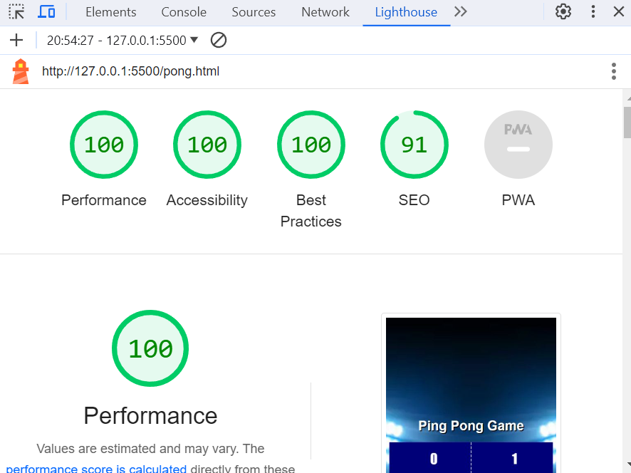
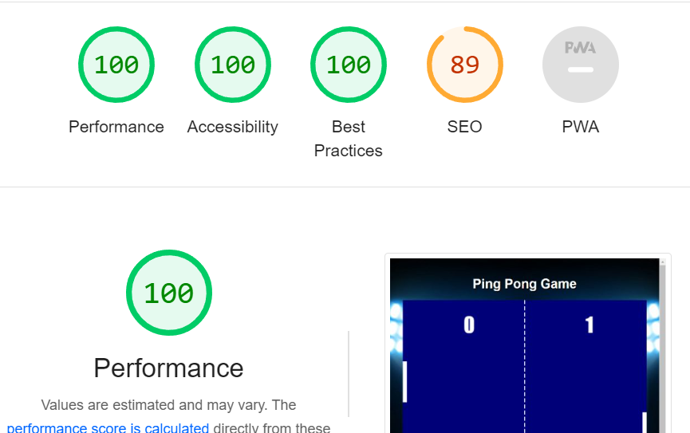

# Ping Pong Game

This is Ping Pong game made out of mainly JavaScript with elements of HTML and CSS. The aim of the game is to bounce the ball off of the left paddle which the user controls and try to get the ball past the right paddle which the computer controls. 

# Site Goals

The aim is to use the left ping pong paddle to score a higher points than the computer operated paddle on the right hand side. 

The ball will be served to the computer first everytime, the computer paddle will react to hit the ball in the direction of the players paddle where the player will use their mouse to control the paddle. Everytime the ball hots the paddle, the ball speed will increase making it harder and harder to judge where the ball might go. 

If either player misses the ball, the opposing player will gain a point. The player with the most points after you stop playing, is the winner.

# WireFrames 

 

 
Desktop Wireframe

 

 

    
Mobile Wireframe

 

# Features

### Landing Page
The landing page is made up of a ping pong background, a title and a button that takes you through to the actual game itself. This page is responsive.

### Game 
Using the HTML canvas, combined with many arguments involving division, multiplication and angles, you can play a game of ping pong against the computer. This page is responsive.

# Technologies Used

* JavaScript
* HTML
* CSS

# Testing 

I tested my HTML, CSS and JavaScript using online validators.
* https://validator.w3.org/nu/#textarea
* https://jigsaw.w3.org/css-validator/validator
* https://jshint.com/

Things I would improve if I had more time would include:
* Rounds of Table Tennis
* Stopping the ball lagging when it gets too fast
* Add a leaderboard section

# Accessibility 

Mobile Lighthouse Score

Desktop Lighthouse Score

# Credits

### Images
Home Page Image - https://www.freepik.com/free-photos-vectors/table-tennis
Game Page Image - https://www.pinterest.co.uk/pin/502362533405665639/

# Deployment

The site was deployed using GitHub pages. The steps to deploy using GitHub pages are:

1. Go to the repository on GitHub.com
2. Select 'Settings' near the top of the page.
3. Select 'Pages' from the menu bar on the left of the page.
4. Under 'Source' select the 'Branch' dropdown menu and select the main branch.
5. Once selected, click the 'Save'.
6. Deployment should be confirmed by a message on a green background saying "Your site is published at" followed by the web address.